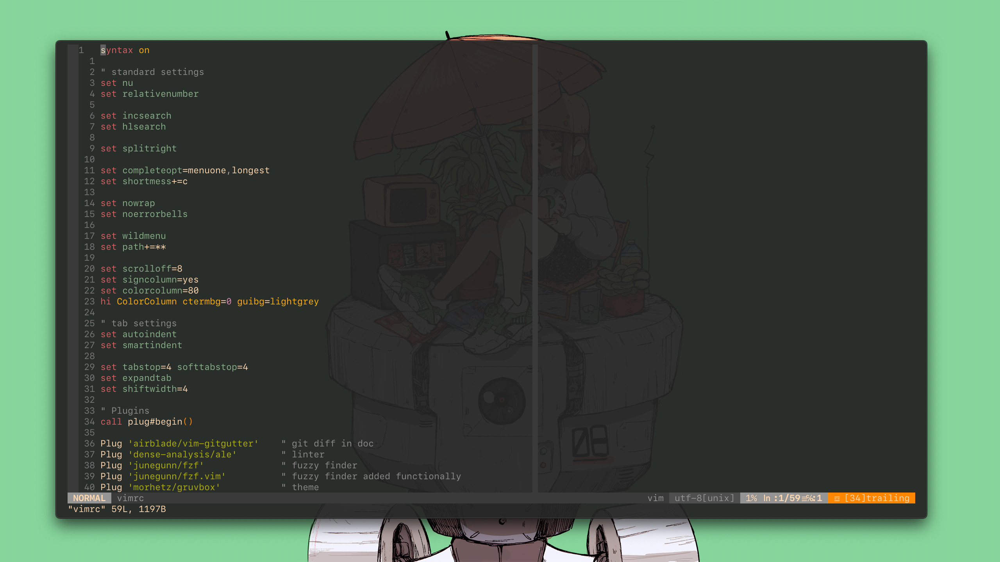

# dotfiles

This repo is intended to store my dotfiles such as vimrc, 
and aliases I use within my dev environments.

## vimrc preview

## vimrc overview

Current version of my vimrc and plugins I use,
uploading to github to be able to distribute easily between my machines.

#### Plug in manager: 

- [GitHub vim-plug](https://github.com/junegunn/vim-plug)

## plugins:

| plugins       | link                                                  |
|:-------------:|:-----------------------------------------------------:|
| vim-gitgutter | [GitHub](https://github.com/airblade/vim-gitgutter)   |
| ale           | [GitHub](https://github.com/dense-analysis/ale)       |
| fzf           | [GitHub](https://github.com/junegunn/fzf)             |
| fzf.vim       | [GitHub](https://github.com/junegunn/fzf.vim)         |
| gruvbox       | [GitHub](https://github.com/morhetz/gruvbox)          |
| nerdtree      | [GitHub](https://github.com/preservim/nerdtree)       |
| vim-airline   | [GitHub](https://github.com/vim-airline/vim-airline)  |
| AutoComplPop  | [GitHub](https://github.com/vim-scripts/AutoComplPop) |

## terminal preview

## terminal overview

This is the current state of my terminal I use the z-shell(zsh),
I use the following alongside zsh in my environment:

| zsh             | link                                                  |
|:---------------:|:-----------------------------------------------------:|
| oh-my-zsh       | [website](https://ohmyz.sh/)                          |
| starship prompt | [website](https://github.com/junegunn/fzf)            |

## aliases overview

Within my zshrc file there are some aliases, the frist couple are paths to some
of my folders. But the rest are aliases I use to make my git workflow easier
and useful commands such as history | grep. 
