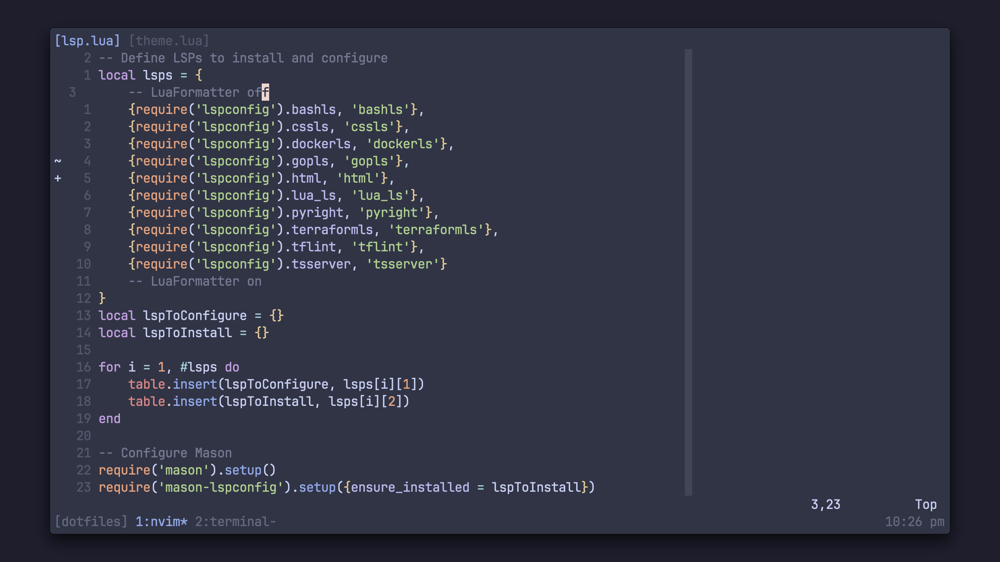

# dotfiles

> This repo is intended to store my configurations for things such as tmux and
> neovim

## preview



## Zshrc

To use the custom Aliases file please add the following into you `.zshrc` file:

```shell
# Add to .zshrc
source $HOME/.config/aliases/aliases
```

## Bashrc

To use the custom Aliases file please add the following into you `.bashrc` file:

```shell
# --- Add aliases to bashrc ---
if [ -f ~/.config/aliases/aliases ]; then
    . ~/.config/aliases/aliases
fi
```

## Keyboard notes (mode 65)

Commands to get via to work within Linux:

```
sudo chmod a+rw /dev/hidraw*
```

Once updated return the permissions back to what they were previously set to:

```
sudo chmod 600 /dev/hidraw*
```
