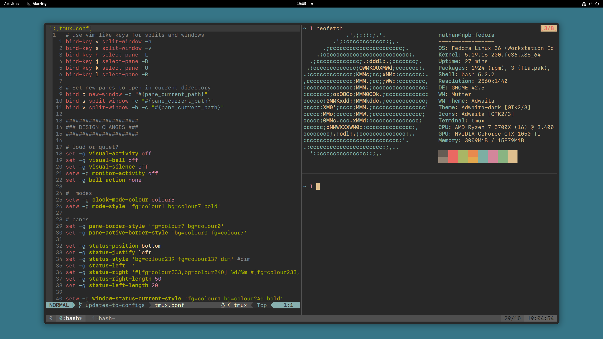

# dotfiles

This repo is intended to store my configurations for things such as tmux
and neovim.

## preview

## Plugin manager for vim and neovim: 

- [neovim plugin manager](https://github.com/wbthomason/packer.nvim)
- [vim plugin manager](https://github.com/junegunn/vim-plug)

> **note** I currently use neovim and the vim setup won't be maintained
